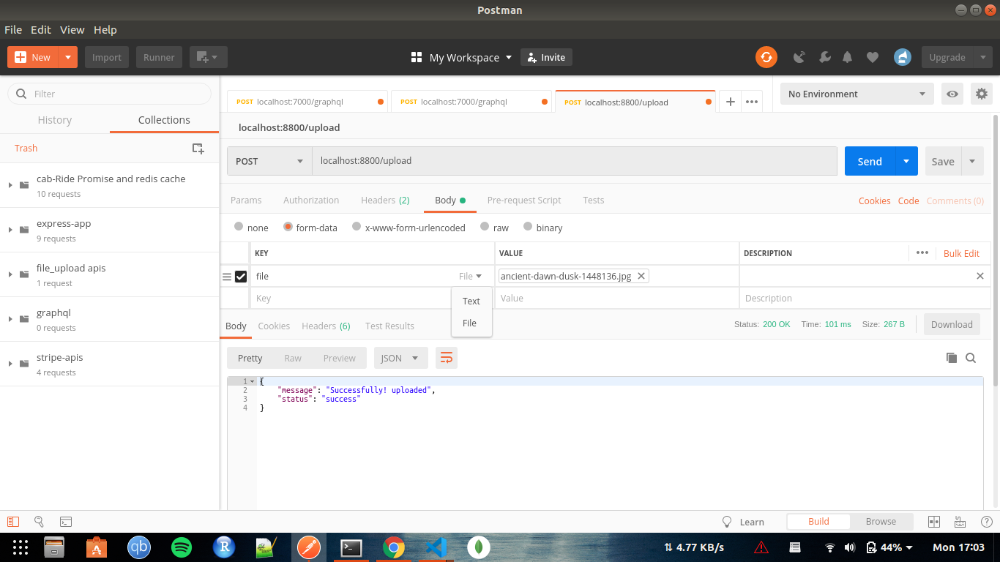

##### 
## :heart: Star :heart: the repo to support the project or :smile:[Follow Me](https://github.com/kanchan0).Thanks!

# FileUpload_nodejs
  This is a simple project to exaplain you the concept of how you can take data like image,audio or video 
  from frontend and store it to the database. Here, I have only uploaded the meta data related to the file
  but the file is stored in the local storage only. You can go ahead and upload the file also but this is 
  not always fisible.

#### To get started follow the steps 
##### 1. clone the project git@github.com:kanchan0/FileUpload_nodejs.git
##### 2. Make a folder in root directory named config and a file name keys.js inside it
         this file contain the details of the database connectivity. Give the details in
         the following format
         
         module.exports={
               host     : 'localhost',
               user     : "user_name",
               password : 'password',
               database : 'database_name'
          }
         
##### 3. run "npm install" to download all the dependencies
##### 4. Run the project by "nodemon server.js" or "node server.js"

##### Note:- This is for backend use only so you can use postman to test it.I am attaching snapshot too.

